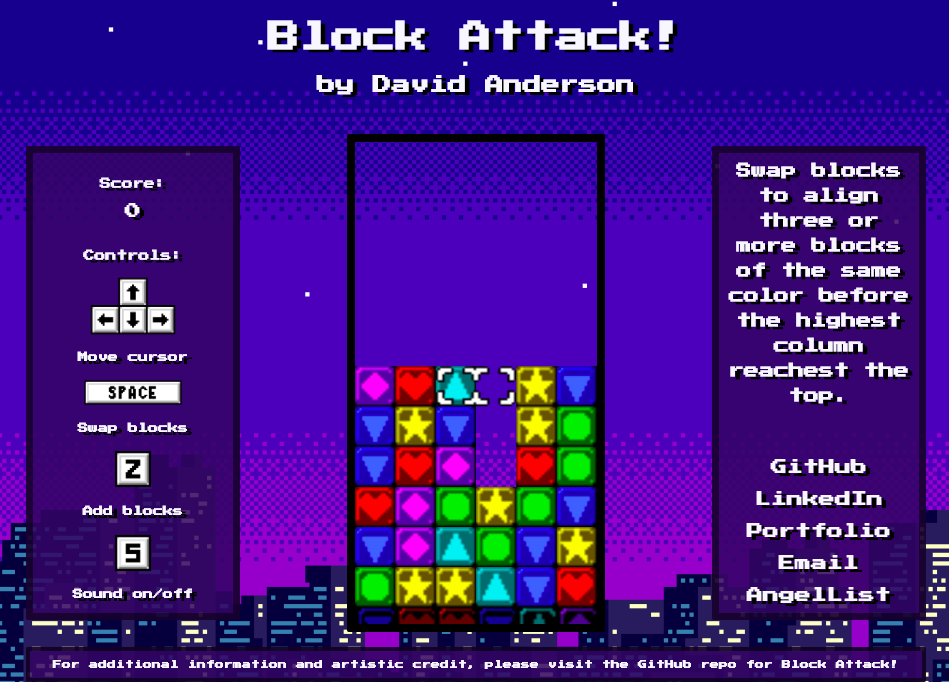

# Block Attack!

### Background

[Block Attack! Live](http://www.davidanderson.nyc/Block-Attack)



Block Attack! is a JavaScript puzzle game inspired by [Tetris Attack](https://www.youtube.com/watch?v=c8FtDgDPTbY&t=136s). Using a cursor, a player navigates a grid and flips the horizontal position of two blocks. If three or more blocks of the same color form a horizontal or verticle line, the blocks disappear, and the player is awarded points. Once the player's blocks hit the top of the grid, the game is over. 

### Technologies and Architecture

Block Attack! implements with the following technologies:

- `JavaScript`
- `HTML Canvas`

Block Attack! is built on a 6x13 grid; the bottom-most row rises from off-canvas until it is in the penultimate position. Before fully entering the visible grid, the bottom row is not available for player manipulation or puzzle solutions. 

The grid is populated with randomly generated blocks; once the grid is populated, a second function checks to remove any groupings of blocks that would provide immediate solutions upon game start. 

```javascript
createGrid() {
    let grid = [];

    for (let height = 0; height < 13; height++) {
        grid.push(new Array(6).fill(instance));
    }

    for (let row = 12; row > 4; row--) {
        for (let col = 0; col < 6; col++) {
            if (col !== 3) {
                grid[row][col] = new Block();
            }
        }
    }

    for (let x = 10; x < 13; x++) {
        grid[x][3] = new Block();
    }

    return clearSolutionsBeforeStart(grid);
}
```

New rows are added to the grid every six seconds. Like the start board, rows are randomly generated and then checked for starting clusters. 

```javascript
createNextRow() {
    let nextRow = [];

    for (let i = 0; i < 6; i++) {
        nextRow.push(new Block());
    }

    nextRow = clearSolutionsFromNewRow(nextRow, this.grid);
    this.checkGameOver(this.grid.shift());
    this.grid.push(nextRow);
    this.fall();
}
```

Block Attack! has 22 unique solutions. When checking the grid for solutions, the checking function iterates from top (y = 0) to bottom (y = 11) and left (x = 0) to right (x = 5). The first blocks of a solution will always be the top-most or the left-most. The checking algorithm first checks for solutions vertically, then horizontally. 

Players are awarded more points for more complex solutions (solutions that clear more blocks). The game is over once the top row of the grid has any non-zero values. 

### Future features

- Create difficulty settings that players can choose before starting a game. 
- Add falling blocks at incremented intervals and with random heights and widths that can be broken apart by solutions elsewhere on the grid. 
- Add a computer opponent or multiplayer option. 

### Artistic credits

Block Attack! was inspired by Tetris Attack (developed by Intelligent Systems and published by Nintendo in 1995). Game sprites were taken from [Tetris Attack JS](https://github.com/tzwaan/tetris-attack-js). "Blaze Stage" (background music) was taken from [Zophar's Music Domain](https://www.zophar.net/music/nintendo-snes-spc/tetris-attack). Sprites and music originally appeared in Tetris Attack. "Coin" sound effect was taken from [The Mushroom Kingdom](https://themushroomkingdom.net/media/smw/wav) and originally apeared in Super Mario World (developed and published in 1990 by Nintendo). Background image artist unknown. 